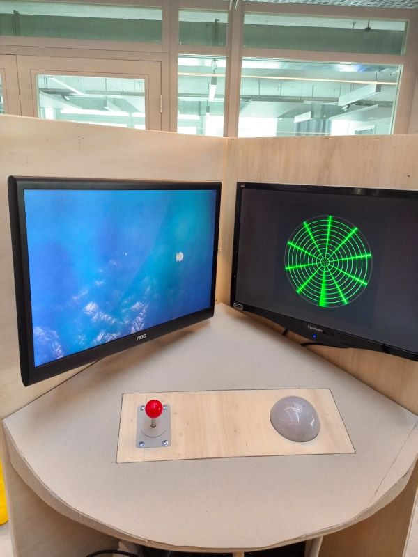

# Un océan de promesse

## Arduino

## Unity

### terrain

### Movement

### Poissons

For the part related to fish generation and their movement, we used the animatedfish packet created by Quaternius (see credits.txt) which contains the following fish assets:
- Dolphin

- Fish1

- Fish2

- Fish3

- Shark 

- Whale

- Manta Ray

These assets could be found inside **Assets/fish** folder

For generating a sufficient number of these fish we wrote a Spowning script inside the Spowner object in SampleScene (Assets/Scenes/SampleScene). 

In this script, an array of GameObjects is given, where any number of fish could be added to it, then a loop generates for each gameObject 7 identical instants ( **numObjects** variable in the script) distributed randomly in different positions inside the boundaries of our terrain. 

As for the movement of the fish, We implemented a simple movement trajectory where the fish oscilate vertically moving through the terrain, this movement was defined in the FishMovement.cs script. (Found in the Assets/Scripts folder)

##### Possible future work: 

1. Adding more complex and artistic movement to the fish such as jumping from water

2. We also developped an underwater view with a terrain that we worked on using blender (can be found in public/Cool-Surface in the github repository), where the user could get a more immersive experience in discovering the underwater life of algae and fish.

